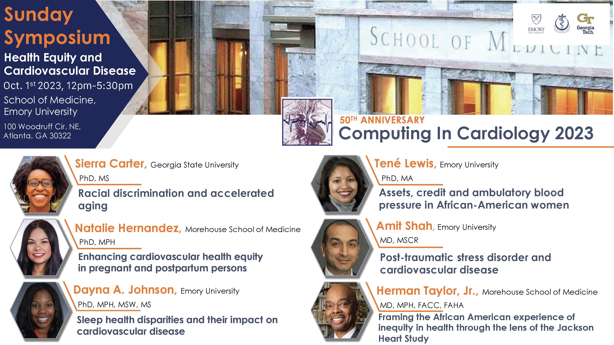

## Sunday Symposium
The Sunday Symposium will address **arrhythmias and cardiovascular challenges in sports**.

## Program

## Speakers

  
  

    <h3>Dr. Yoram Rudy</h3>
    

      Distinguished Professor Emeritus · Washington University in St. Louis, USA 
      Member, US National Academy of Engineering · Fellow, US National Academy of Inventors
    

    
Multi-Scale Integration from Molecular Structure to Whole-Cell Function — Examples from Cardiac Electrophysiology

    

      Mutations and many disease-causing processes occur at the molecular scale, but their manifestation (e.g., cardiac arrhythmias) occurs at the cellular, tissue, organ and organism levels. Integration across scales and understanding of processes that determine emergent behaviors at higher scales are essential for mechanism-based "precision medicine". Examples from cardiac electrophysiology will be shown, where computer modeling has been used to relate an ion-channel protein structure/function to the whole-cell action potential. The presentation will focus on IKs, an ionic current that underlies rate dependence of the cardiac action potential.
    

    

      <a href="https://rudylab.wustl.edu/" target="_blank">rudylab.wustl.edu</a> · <a href="http://cbac.wustl.edu" target="_blank">cbac.wustl.edu</a>
    

  

### Other Speakers (Tentative)

* Dr. Ramon Brugada
* Dr. Josep Brugada
* Dr. Julián Pérez-Villacastín
* Dr. Manuel Marina and PhD Eng. José María Lillo — [Idoven](https://es.idoven.ai/){: target="_blank"}

<!---->
1. When: Sunday, September 20, 2026 <!--at 12pm-5:30pm-->
1. Where: [Hospital San Carlos](https://www.urjc.es/grado/591-situacion-planos-campus-aranjuez){: target="_blank"},  Universidad Rey Juan Carlos - Aranjuez Campus
1. Address: [C/ Capitán Angosto Gómez Castrillón 91, 28300 Aranjuez-Madrid](https://maps.app.goo.gl/T84i8sHBrJ2vLaqx7){: target="_blank"}

<link rel="stylesheet" href="https://cdn.jsdelivr.net/npm/@splidejs/splide@4.1.4/dist/css/splide.min.css">

  

    <ul class="splide__list">
      <li class="splide__slide">
        
      </li>
      <li class="splide__slide">
        
      </li>
      <li class="splide__slide">
        
      </li>
      <li class="splide__slide">
        
      </li>
      <li class="splide__slide">
        
      </li>
    </ul>
  

 

<!--1. Transportation: -->

<!--* **CinC 2023 designated bus:** Transportation designated for the CinC 2023 Sunday Symposium will be provided to all conference attendees for the entire day. On the Emory [TransLoc.com](https://emory.transloc.com/m/){: target="_blank"} site or [TransLoc app](https://emory.transloc.com/info/mobile){: target="_blank"} go to search box and find **"Biomedical Informatics"** shuttle. This feature offers real-time location tracking and a concise map of the route for transportation to the Sunday Symposium venue. [CinC 2023 designated bus schedule](https://cinc2023.github.io/assets/img/sunday_transportation.pdf).-->
<!-- * **Getting On:** [Georgia Tech Hotel entrance](https://maps.app.goo.gl/4on2MC8iAbRpJufb6).\-->
<!--  -->

<!--* **Shuttles:** Take one of the charters that you see. **"CinC2023 Sunday Symposium"** sign will be on the charter door and window.\
<!-- 
<!--

<!--* **Taking Off:** Take off the shuttle at "Woodruff Circle" in Emory campus, and Emory School of Medicine building will be on your right.\
<!--

<!--* **Public transportation:** -->
<!--Getting on MARTA 36: Midtown Station\-->
<!--Getting off MARTA 36: N Decatur Rd NE & Clifton Rd\-->
<!--MARTA 36 [bus route](https://www.itsmarta.com/pdfs/maps/36.pdf) and [schedule](https://www.itsmarta.com/36.aspx)-->

<!-- ## Sunday evening reception--> 
<!--The reception will be ready at the Michael C. Carlos Museum on the Emory University campus, 10 minutes walk from the Sunday Symposium venue, James B. Williams Medical Education Building (map below). -->
<!--1. When: Sunday, October 1st, 2023 at 6:30pm-8:30pm-->
<!--2. Where: [Michael C. Carlos Museum](https://carlos.emory.edu/){: target="_blank"} on the Emory University campus-->
<!--3. Address: [571 South Kilgo Circle Atlanta, GA 30322](https://goo.gl/maps/199kRV6W3es9JHre7){: target="_blank"}-->
<!--4. Transportation: Transportation designated for the CinC 2023 Sunday Symposium will be provided to all conference attendees for the entire day. On the Emory [TransLoc.com](https://emory.transloc.com/m/){: target="_blank"} site or [TransLoc app](https://emory.transloc.com/info/mobile){: target="_blank"} you will find a dedicated CinC 2023 vehicle to select. This feature offers real-time location tracking and a concise map of the route for transportation to the evening reception venue. [CinC 2023 designated bus schedule](https://cinc2023.github.io/assets/img/sunday_transportation.pdf)-->

<!--* **Getting On:** [Georgia Tech Hotel entrance](https://maps.app.goo.gl/4on2MC8iAbRpJufb6).\-->
<!---->

<!--* **Shuttles:** Take one of the charters that you see. **"CinC2023 Sunday Symposium"** sign will be on the charter door and window.\-->
<!-- -->
<!---->

<!--* **Taking off:** Your stop is on Fishburne Dr., as shown in the image below. Walk for a minute to Mizell Dr. to reach the entrance of the Carlos Museum.\-->
<!-- -->

<!--### Map to the Carlos Museum from Emory School of Medicine Building-->

<!--<iframe src="https://www.google.com/maps/embed?pb=!1m30!1m12!1m3!1d3315.791437592353!2d-84.32575377429465!3d33.79188362325614!2m3!1f0!2f0!3f0!3m2!1i1024!2i768!4f13.1!4m15!3e2!4m3!3m2!1d33.7933269!2d-84.3216636!4m3!3m2!1d33.792624499999995!2d-84.32401759999999!4m5!1s0x88f506f030d8c67f%3A0xe19cbc6584c08754!2sMichael%20C.%20Carlos%20Museum%2C%20South%20Kilgo%20Circle%20Northeast%2C%20Atlanta%2C%20GA!3m2!1d33.790344999999995!2d-84.3243433!5e0!3m2!1sen!2sus!4v1696163672796!5m2!1sen!2sus" width="600" height="450" style="border:0;" allowfullscreen="" loading="lazy" referrerpolicy="no-referrer-when-downgrade"></iframe>-->

[Top of Page](#top){: .btn}

---

[Calendar](../dates/) &#9632; [Registration](../registration) &#9632; [Authors](../authors) &#9632; [Programme](../programme/) &#9632; [Travel](../travel/) &#9632; [PhysioNet Challenge](../challenge/) &#9632; [FAQ](../faq/)
